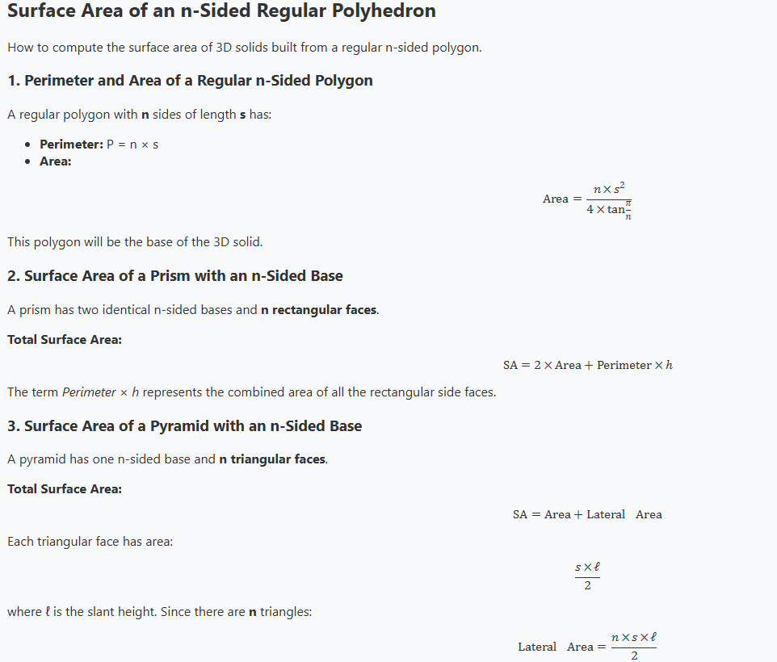

# Portfolio

This is my portfolio for getting into college. It includes original music, interactive web pages, and other digital work.

## Features

- Music files in **.pdf** and **.mp3** formats, each made with MuseScore 4.6.2  
- Multiple **HTML pages** to view in your browser  
- Example screenshot:  
  

## How to Run

1. Clone the repository  
   ```bash
   git clone https://github.com/yourname/project
   ```
2. Open `index.html` in your browser  
3. Enjoy!

## Built With

- HTML / CSS / JavaScript  
- Scratch  
- MuseScore 4.6.2  
- VS Code  

## Project Structure

```txt
.
├── tips/
├── visualizer/
├── images/
└── README.md
```

## Scratch Projects

- [Meteor Shower!](https://scratch.mit.edu/projects/1306960035/): Dodge meteors while going through space!
  -- Made in 6th grade
